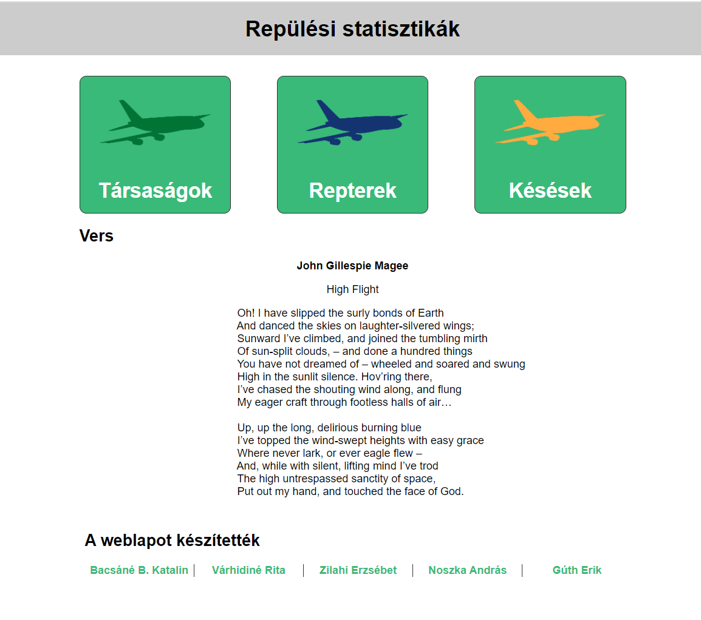

# Saturday_Project
Saturday afternoon fever

## Hogyan kezdődött a projekt?

Az [ITMP klubnak](https://itmp.hu/) és a [Green Fox Academy](https://www.greenfoxacademy.com/)-nek köszönhetően részt vehettünk a "Technológia és módszertan a projektalapú informatika oktatáshoz" címet viselő 2 alkalmas képzésen. 
A képzés keretében olyan eszközökkel ismerkedhettünk meg, amik ma már nélkülözhetetlenek a csapatban végzett, projektalapú IT tevékenységeknél. S hogy mindezt a gyakorlatban is megtapasztalhassuk, egy [projekt](https://github.com/green-fox-academy/http-info-syllabus/blob/master/project-work.md) megvalósítását kapták a csapatok feladatként.

## Projekt a workshop alatt

A projekt alatt 4 fős csapatunk volt, egy mentor támogatásával. 

### Mentorunk: 
 - Noszka András

### A csapat tagjai:

 - Várhidiné Rita
 - Zilahi Erzsébet
 - Bacsáné Kata
 - Gúth Erik
 
Egy repüléssel kapcsolatos statisztikai web-oldalt kellett létrehoznunk.

### A web-oldal felépítése:

 - Főoldal
 - Légitársaságok Listája
 - Légitársaság oldalak
 - Repterek oldal
 - Késések oldal
 - Önéletrajz oldalak
 
Még a weboldal létrehozása előtt többlépcsős feltörési feladat várt ránk, hogy a rejtjelezetten megkapott vers szövegét megtudjuk, amit a főoldalon kellett megjeleníteni.

Szintén feladat volt a megjelenítendő adatok kinyerése a forrásul kapott Excel táblázatból, és internetes gyűjtőmunka a megjelenítendő képek, ikonok, koordináták tekintetében.

### A feladataink között volt:

 - HTML és CSS fejlesztés
 - JavaScript fejlesztés
 - Képek méretezése és vágása
 - Ikonok színezése
 - Adat elemzés CSV file-okból
 - File olvasás és manipulálás szabadon választott programozói környezetben
 - Képek gyűjtése internetről
 - Dokumentáció készítése 
 
### Az első nap eredményei:

 - A rejtjelezés megfejtéséhez a 3 feltörési feladat eredményeképpen előállt az eltolás mértéke: 16
 - Ez alapján sikerült dekódolni a vers szövegét
 - Kigyűjtöttük a légitársaságokat, és a légitársaságok logóit
 - A repülőgép-, és a serleg-ikonok, illetve a logók méretezése, színezése is megtörtént
 
 
 
### A köztes két hét eseményei:

 - Apránként minden adatelemzés megtörtént, előálltak a weboldalakhoz szükséges információk
 - Elkészült a főoldal html és css kódja
 - S utána sorban az aloldalaké is
 
### A második nap eredményei:

 - Megbeszéltük a befejezés mikéntjét
 - ...
 